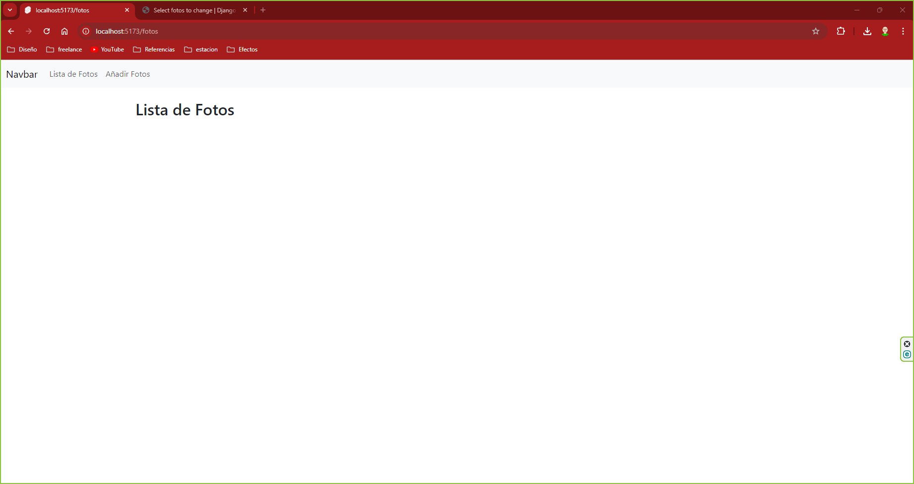
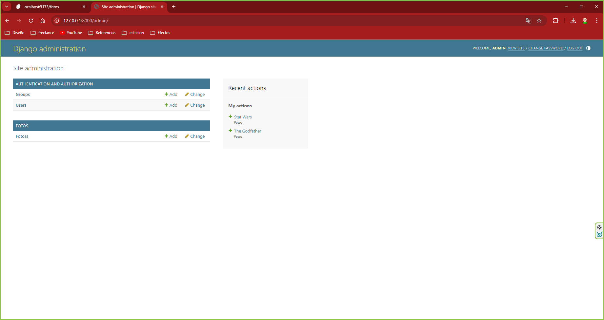
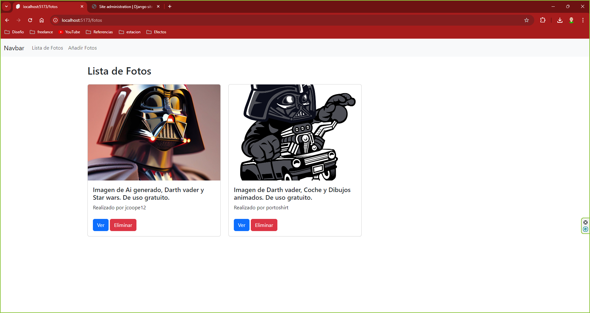
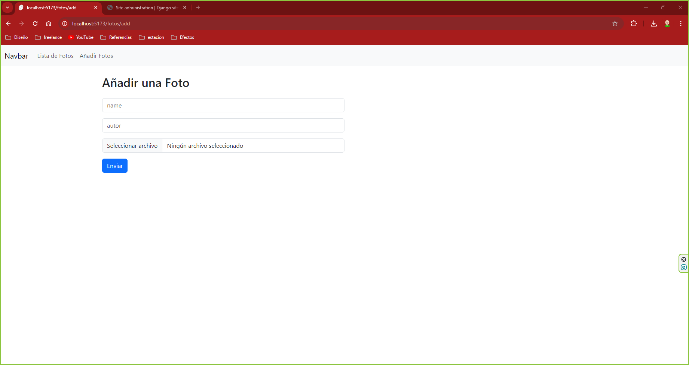
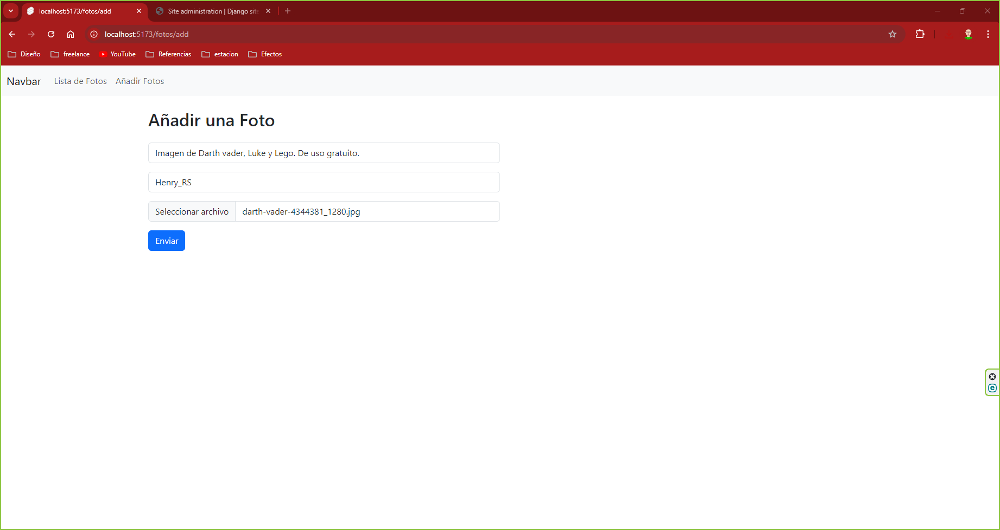
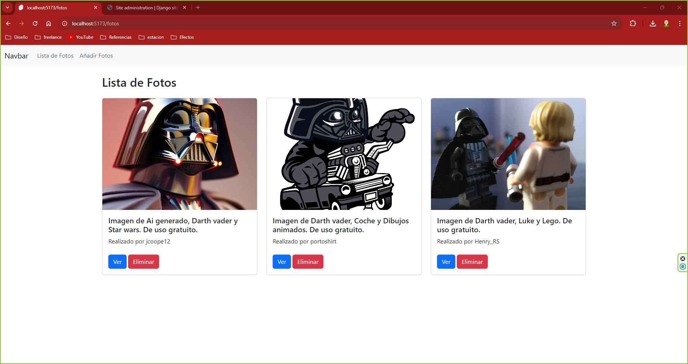
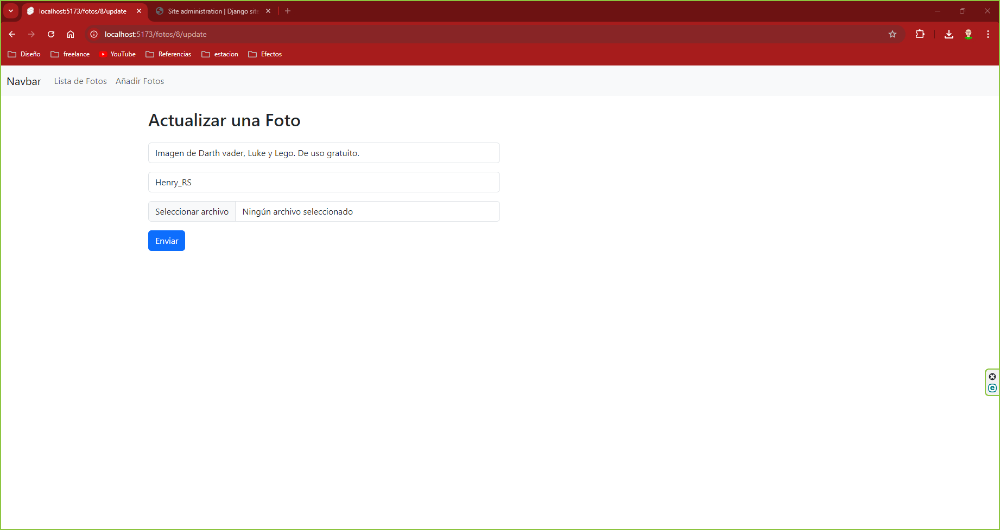
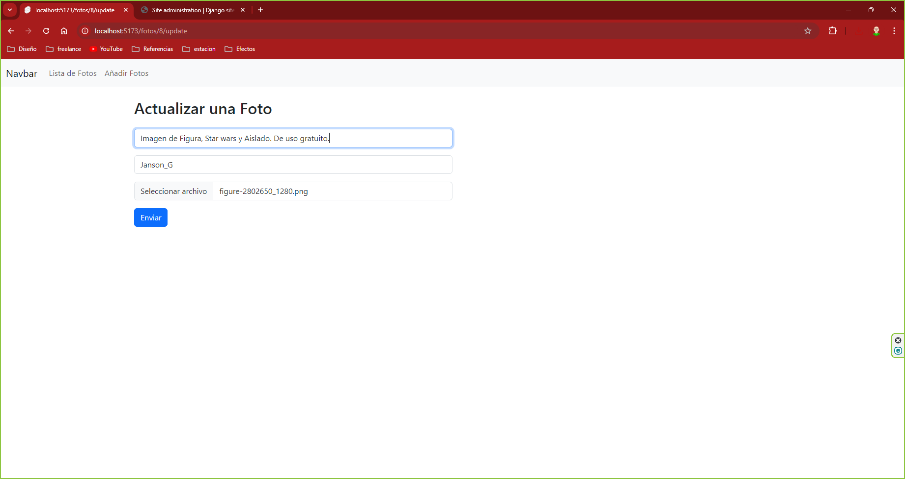

# MI APP DE FOTOS

En esta aplicación podremos gestionar nuestras fotos. Es una aplicación donde puedes guardar tus fotos favoritas con un título y con el autor de la misma.
Estas fotos se guardan en una base de datos.
También se pueden eliminar las fotos de esta base de datos y modificarlas, tanto el título, como el autor o cambiar la foto.

Esta aplicación es básica y se le pueden añadir más contendio como filtrado, ordenar por orden alfabetico, por fecha de subida, etc.

Se libre de modificarla a tus necesidades y creatividad.

---

1. [Tecnologías](#tecnologias)
2. [Instalación](#instalación)
3. [API: Methods y Endpoints](#api-methods-y-endpoints)
4. [Screenshots](#screenshots)
5. [Documentación y Recursos](#documentación-y-recursos)
6. [Créditos](#créditos)

---

## Tecnologías
### Frontend:


He utilizado Svete para el frontend porque me parace muy sencilla de implementar y de programar. Además puedes darle estilo exclusivo a cada elemento que crees en la interfaz. esto es muy provechoso para no liarte con la implementación de estilos.
Gracias a esto, con el Bootstrap instalado, se puede dar estilo a cada elemento e incluso crear un generico para todas las páginas.

### Backend:


He utilizado Django ya que el lenguaje Python resulta más sencillo de utilizar e implementar que Java, que podría haber sido la otra opción como backend.

### Version Control:
 


### Otros:


---

## Instalación
Programas y Dependencias en Windows usando Visual Studio Code.
Antes de comenzar, asegúrate de tener instalado Visual Studio Code en tu sistema Windows.

### FRONTEND
#### Instalación de Node.js
Node.js es necesario para manejar las dependencias de frontend y compilar tu proyecto Svelte. Para instalarlo:

1. Descarga Node.js desde nodejs.org e instala la versión LTS.
2. Abre Visual Studio Code y abre una nueva terminal (Ctrl + `).
3. Verifica la instalación con el siguiente comando en la terminal de VS Code:

```
node -v
npm -v
```

#### Creando un proyecto con create-svelte
Todo lo que necesitas para construir un proyecto Svelte, impulsado por [`create-svelte`](https://github.com/sveltejs/kit/tree/master/packages/create-svelte).

```
# crear un nuevo proyecto en el directorio actual
npm create svelte@latest

# crear un nuevo proyecto en my-app
npm create svelte@latest my-app
```

#### Instalación de Bootstrap
Bootstrap es un framework CSS que te ayudará a crear interfaces de usuario estilizadas.

Instala Bootstrap con NPM en la terminal de VS Code:

```
npm install bootstrap
```

#### Desarrollo con Svelte
Una vez que hayas creado un proyecto Svelte e instalado las dependencias:

1. Inicia un servidor de desarrollo desde la terminal de Visual Studio Code:

```
npm run dev
```

2. Abre automáticamente la aplicación en tu navegador con:

```
npm run dev -- --open
```

#### Construcción para Producción
Para compilar tu aplicación Svelte para producción:

```
npm run build
```

Puedes previsualizar la versión de producción con:

```
npm run preview
```

> Para desplegar tu aplicación, es posible que necesites instalar un [adaptador](https://kit.svelte.dev/docs/adapters) para tu entorno objetivo.

### BACKEND
#### Instalación de Python
Python es necesario para desarrollar la parte backend de la aplicación con Django.

1. Descarga Python desde python.org e instala la versión más reciente.
2. Durante la instalación, asegúrate de marcar la opción "Add Python to PATH".
3. Verifica la instalación con el siguiente comando en la terminal de VS Code:

```
python --version
pip --version
```

#### Instalación de Django
Django es el framework backend que utilizarás para desarrollar tu aplicación web.

En la terminal de Visual Studio Code, instala Django con:

```
pip install django
```

#### Instalación de Django Rest Framework
Django Rest Framework se utiliza para crear APIs en tu aplicación Django.

Instala Django Rest Framework con:

```
pip install djangorestframework
```

#### Instalación de Pillow
Pillow es una biblioteca de Python necesaria para manejar imágenes en Django.

Instala Pillow con:

```
pip install pillow
```

#### Instalación de Django-cors-headers
Este middleware es esencial para resolver problemas de CORS (Cross-Origin Resource Sharing) en Django.

Instala Django-cors-headers con:

```
pip install django-cors-headers
```
---

## API: Methods y Endpoints

| Método | Path          | Comentario                                           |
|--------|---------------|------------------------------------------------------|
| GET    | /fotos/        | Listar todas las fotos.                             |
| POST   | /fotos/        | Crear una nueva foto.                              |
| GET    | /fotos/{id}/   | Obtener detalles de una foto específica.            |
| PUT    | /fotos/{id}/   | Actualizar una foto existente.                      |
| PATCH  | /fotos/{id}/   | Actualizar parcialmente una foto existente.         |
| DELETE | /fotos/{id}/   | Eliminar una foto específica.                       |
| GET    | /fotos/        | (Comentado) Listar todas las fotos usando `FotoListAPiView`. |
| GET    | /fotos/{id}/   | (Comentado) Obtener detalles de una foto específica usando `FotoDetailAPIView`. |

---

## Screenshots
### Iniciar frontend

### Página principal sin inciar el servidor backend

### Iniciar backend

### Página backend

### Página principal

### Página añadir



### Página actualizar o modificar



### Página principal eliminar


---

## Documentación y Recursos

### Docs
 <p>
    <a href ="https://svelte.dev/docs/introduction" style="color: lightgrey; display:flex; align-items:center; gap:7px;">
        
    </a>
    <a href = "https://kit.svelte.dev/docs/introduction" style="color: lightgrey; display:flex; align-items:center; gap:7px;">
        
    </a>
    <a href = "https://www.django-rest-framework.org/" style="color: lightgrey; display:flex; align-items:center; gap:7px;">
        
    </a>
    <a href = "https://pypi.org/project/django-cors-headers/" style="color: lightgrey; display:flex; align-items:center; gap:7px;">
        
    </a>
</p>

---
## Créditos
<p>
    <a href ="https://github.com/FranciscoDocente" style="color: white; display:flex; align-items:center; gap:7px;">
        Francisco Rueda
    </a>
</p>

## Inspiración
Este proyecto esta inspirado en uno que ha creado https://github.com/bugbytes-io/svelte-django-app